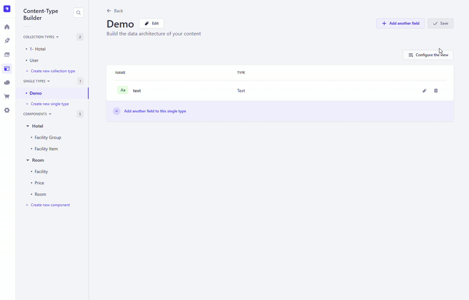

# date-range-picker-5

This date-range-picker plugin allows you to select a data range in one CustomField instead of adding two seperate date field.
 
Strapi Custom Field for Date Range 

[GitHub](https://github.com/muammerkeles/strapi-date-range-picker-5) - [npm](https://www.npmjs.com/package/strapi-date-range-picker-5)


Watch the video:

 


 


--

How to use?

install npm package 

`npm i strapi-date-range-picker-5`

(create file **plugins.js** if not existing inside **config** folder)

config/plugins.js
then add this code inside **plugins.js**
```
module.exports = () => ({
    // ..
    'strapi-date-range-picker-5': {
        enabled: true,
      },
    //..
});

```
_npm run build --clean_

It's ready.

This date-range-picker-5 plugin allows you to select a data range in one CustomField instead of adding two seperate field. 

